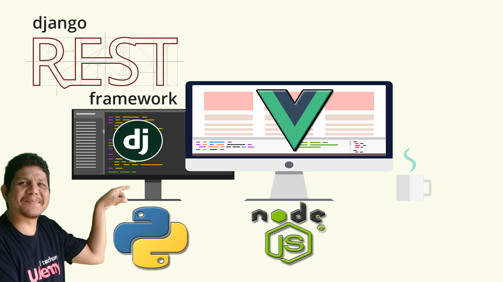

# Proyecto Curso Aprende VueJS + Django a través de ejemplos prácticos 
##  🎖️ [Obténlo al Descuento Oficial en Udemy](https://www.udemy.com/course/experto-en-vuejs-con-django-rest-framework/?referralCode=8BDCEC50053221F3E22D)  🎖️

##### Código Fuente del Proyecto VUEJS

## ☷ Cursos ofrecidos con su Descuento:

☞ Sistema de Compra y Facturación con Python de Django (Hasta 95%)

☞ Domina el ORM de Django (Hasta 90%)

☞ Replicación de Datos con SymmetricDS (Hasta 90%)

☞ Desarrolla Aplicaciones en Capa con ADO NET (Hasta 90%)

☞ Entity FrameWork para principiantes (Hasta 60%)

☞ Y muchos más...

### 💥 Descuento de hasta 95% 💓
##### Precio $9.99 en cualquier curso

##  [Aprovecha Descuento USD 9.99 o menos según tu país en Udemy](https://mailchi.mp/ffe98a904854/mejor-precio-cursos-udemy) 

## ☝ ☝ ☝ ☝ ☝ ☝ ☝☝